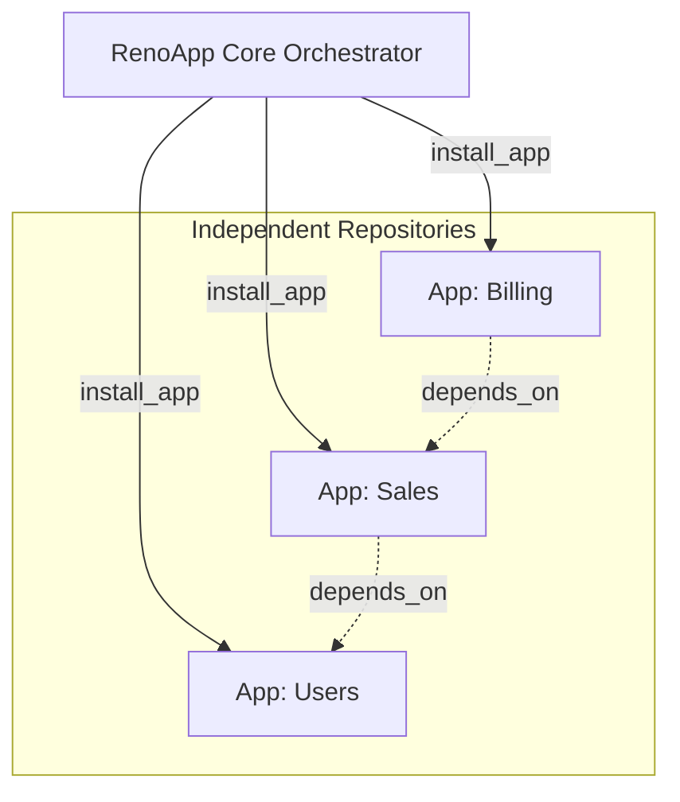
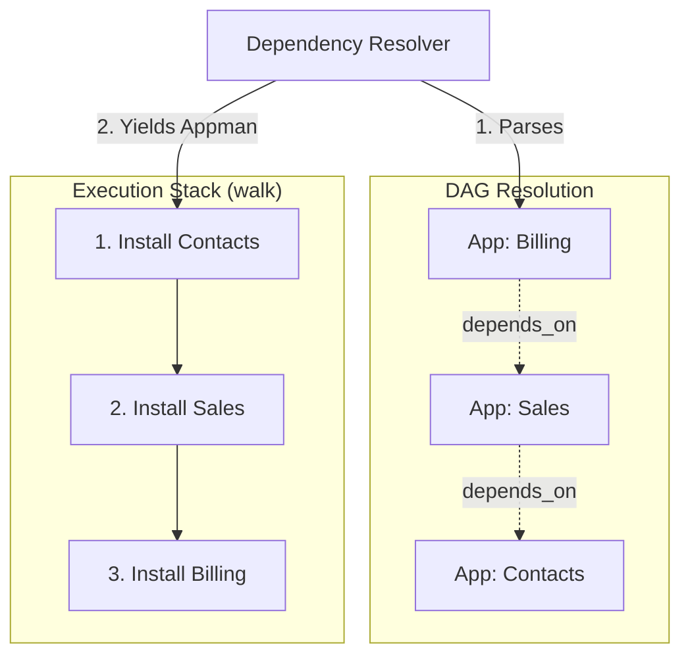

# RenoApp (Core Orchestrator)

## Introduction
RenoApp is a base framework built on top of Django designed to act as a central application orchestrator. Instead of developing monolithic features directly within the core, this project allows multiple applications (micro-apps or plugins) to be integrated dynamically and automatically.

## Objective
The main objective of RenoApp is to emulate a modular architecture similar to robust ERPs (like Odoo), but offering a **friendly and modern Developer Experience (DX)**.

Each application within the RenoApp ecosystem:
- Is developed as an independent repository or module.
- Is dynamically discovered and installed when placed in the `apps/` directory.
- Configures itself through an `__app__.json` manifest that defines its routes, dependencies, and settings.
- Remains completely isolated and decoupled from the central codebase.

This design allows development teams to rapidly scale features without modifying the core, reducing bottlenecks and facilitating long-term maintenance.

## Technical Architecture

### Dependency Management
External dependencies are resolved via independent `requirements.txt` files per app. A custom `install_app [app_name]:[version]` command handles the installation pipeline:
1. Clones the independent app repository into the `apps/` directory.
2. Installs the isolated Python requirements.
3. Resolves the internal dependency graph based on the `depends_on` array inside the `__app__.json` manifest.

### Frontend Integration
Each app is responsible for generating its own frontend assets (e.g., React components). During the `install_app` pipeline, the orchestrator handles the integration automatically:
1. Copies the app's frontend views into a dedicated `frontend/src/apps/` directory within the core.
2. Dynamically rewrites a central registry file (e.g., `apps.config.js`) to inject the newly installed app. This registry contains metadata such as the app's icon, description, and base routing path.
3. Provides a base template to manage the global design and layout.
4. Compiles the final assets.

**Production vs Development:** During development, the frontend runs dynamically alongside the backend. For production, RenoApp compiles all assets to serve a unified Single Page Application (SPA). The backend and frontend will communicate strictly via an API architecture, with planned support for real-time communication using WebSockets.

### Appman (Orchestration Pipeline)
RenoApp includes a robust, transaction-like orchestrator called `Appman` (App Manager). It is designed to safely execute the installation lifecycle of each micro-app.

The installation pipeline follows a strict sequence:
1. `check_reno_dependencies`: Validates the DAG of dependencies to ensure a safe installation order.
2. `generate_app`: Downloads or clones the app.
3. `update_settings`: Updates internal settings and the frontend app registry.
4. `install_requirements`: Installs isolated Python packages.
5. `copy_front`: Extracts and copies frontend React components.
6. `run_migrations`: Applies database migrations.
7. `run_post_install_tasks`: Executes custom shell scripts or initialization commands defined by the app in its `post_install_tasks` array.
8. `restart_server`: Reloads the environment to reflect the new app.

**Rollback Mechanism:** `Appman` implements a Command Pattern with an automated LIFO (Last-In, First-Out) stack. If any step fails, it triggers a `rollback()` method that iterates through the stack in reverse, cleanly undoing the executed tasks (e.g., reverting migrations, deleting copied files) to ensure the system's integrity remains uncompromised.

### Dependency Resolver
To support the `depends_on` manifest properties, RenoApp features a recursive `Resolver`. Since application dependencies form a **Directed Acyclic Graph (DAG)**, the resolver uses a Post-Order Depth-First Search (DFS) or Topological Sort to determine the exact installation order.

1. **Resolution:** It recursively traverses all missing dependencies, detecting and preventing circular dependencies.
2. **Flattening:** It flattens the graph into a strictly ordered execution stack, guaranteeing that "Leaf" applications (those with no dependencies) are installed before the "Root" applications that depend on them.
3. **Execution:** The `walk()` generator yields pre-configured `Appman` instances in the correct topological order. This architectural separation opens the door for future optimizations, such as parallelizing the download phase of the apps before executing their database migrations sequentially.

## License
This project is open-source and free to use, modify, and distribute under the **MIT License**. 

> **IMPORTANT:** You are free to use this system commercially and privately, but you are **obligated to provide attribution and credit** to the original author(s) by maintaining the original license and copyright notices in all copies or substantial portions of the software.
