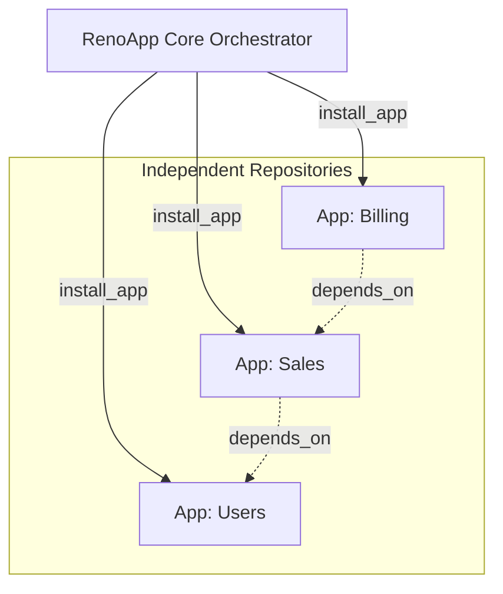

# RenoApp (Core Orchestrator)

## Introduction
RenoApp is a base framework built on top of Django designed to act as a central application orchestrator. Instead of developing monolithic features directly within the core, this project allows multiple applications (micro-apps or plugins) to be integrated dynamically and automatically.

## Objective
The main objective of RenoApp is to emulate a modular architecture similar to robust ERPs (like Odoo), but offering a **friendly and modern Developer Experience (DX)**.

Each application within the RenoApp ecosystem:
- Is developed as an independent repository or module.
- Is dynamically discovered and installed when placed in the `apps/` directory.
- Configures itself through an `__app__.json` manifest that defines its routes, dependencies, and settings.
- Remains completely isolated and decoupled from the central codebase.

This design allows development teams to rapidly scale features without modifying the core, reducing bottlenecks and facilitating long-term maintenance.

## Technical Architecture

### Dependency Management
External dependencies are resolved via independent `requirements.txt` files per app. A custom `install_app [app_name]:[version]` command handles the installation pipeline:
1. Clones the independent app repository into the `apps/` directory.
2. Installs the isolated Python requirements.
3. Resolves the internal dependency graph based on the `depends_on` array inside the `__app__.json` manifest.

### Frontend Integration
Each app is responsible for generating its own frontend assets (e.g., React components). During the `install_app` pipeline, the orchestrator:
- Copies these frontend views into an isolated execution environment.
- Provides a base template to manage the global design and layout.
- Compiles the final assets.

This ensures each app only worries about its specific UI section, while the Core orchestrates a seamless Single Page Application (SPA) experience.

## License
This project is open-source and free to use, modify, and distribute under the **MIT License**. 

> **IMPORTANT:** You are free to use this system commercially and privately, but you are **obligated to provide attribution and credit** to the original author(s) by maintaining the original license and copyright notices in all copies or substantial portions of the software.
